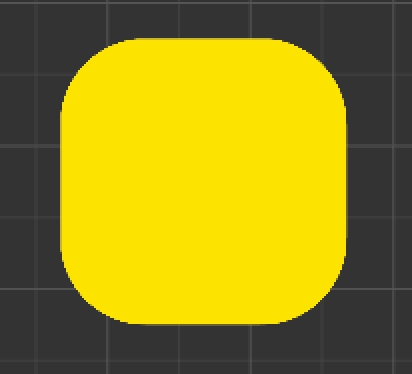

# 圆角矩形

## 圆角矩形的概念

圆角矩形是矩形的一种扩展，它具有圆角边框的矩形。圆角矩形在视觉上比普通矩形更柔和，常用于UI设计中，使界面看起来更加现代和友好。

## 圆角矩形的原理

- 圆角矩形的实现原理主要基于以下几个步骤：

1. 绘制一个矩形
2. 在矩形的每个角上绘制一个圆弧
3. 将圆弧的顶点连接起来，形成一个圆角矩形

## 圆角矩形的实现

1. 使用`cc.Graphics`组件来绘制圆角矩形
- 在Cocos Creator中，可以使用`cc.Graphics`组件来绘制圆角矩形。以下是一个简单的示例代码：

```javascript

cc.Graphics.prototype.roundRect = function(x, y, w, h, r) {
    this.rect(x, y, w, h);
    this.arc(x + w - r, y + r, r, 0, Math.PI * 0.5);
    this.arc(x + w - r, y + h - r, r, Math.PI * 0.5, Math.PI);
    this.arc(x + r, y + h - r, r, Math.PI, Math.PI * 1.5);
    this.arc(x + r, y + r, r, Math.PI * 1.5, Math.PI * 2);
};

```

2. 使用shader来实现圆角矩形

主要是在片元着色器中，根据像素点距离矩形边框的距离，来决定是否绘制该像素点。
已知条件：
1. 矩形的大小（作为参数传入）vec2 size
2. 圆角半径（作为参数传入）float radius
3. 当前像素点的坐标（由顶点着色器传入）vec2 v_uv

实现步骤：
1. 判断当前像素点在哪一个圆角（左上、右上、左下、右下）
2. 根据当前像素点在哪一个圆角，计算出当前像素点距离该圆角圆心的距离dis
3. 判断dis与radius的大小，如果dis小于radius，则绘制该像素点，否则不绘制

伪代码：

```glsl

if(v_uv.x < radius && v_uv.y < radius) {
    // 左上角
    float dis = length(v_uv - vec2(radius, radius));
    if(dis < radius) {
        return color;
    }
} else if(v_uv.x > size.x - radius && v_uv.y < radius) {
    // 右上角
    float dis = length(v_uv - vec2(size.x - radius, radius));
    if(dis < radius) {
        return color;
    }
} else if(v_uv.x < radius && v_uv.y > size.y - radius) {
    // 左下角
    float dis = length(v_uv - vec2(radius, size.y - radius));
    if(dis < radius) {
        return color;
    }
} else if(v_uv.x > size.x - radius && v_uv.y > size.y - radius) {
    // 右下角
    float dis = length(v_uv - vec2(size.x - radius, size.y - radius));
    if(dis < radius) {
        return color;
    }
}

```
**源文件位于project/shader/assets/shader/RoundBoundingRect.effect文件，该文件实现了圆角矩形的绘制，并且支持自定义圆角半径。**
**效果图：**



效果展示场景位于project/shader/assets/effect.fire中，

## 圆角矩形的应用

- 圆角矩形在UI设计中常用于按钮、对话框、卡片等元素的设计，使界面看起来更加现代和友好。
- 圆角矩形在游戏开发中常用于UI设计，使游戏界面看起来更加现代和友好。

## 圆角矩形的扩展

- 可不可以支持椭圆的圆角矩形？
- 可不可以支持圆角矩形的动画？
- 可不可以支持圆角矩形的渐变、描边、阴影？