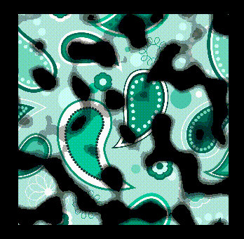
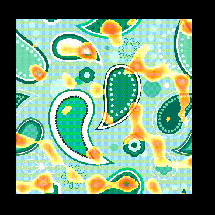

# 溶解效果

## 概念


## 原理
为了实现这种效果，需要标记出哪些像素显示、哪些像素消失，比较好的办法是用一张噪声图来给每一个像素做标记。由于噪声图只有黑白灰三种颜色，黑白灰非均匀分布，因此，可以利用黑透、白不透、灰半透的原理实现不规则溶解效果。而要想实现规则溶解效果也可以使用特定的黑白渐变图片来实现溶解的规则变化。

## 实现思路
1. 根据溶解贴图的rgb某个通道的颜色与溶解阈值对比，如果小于溶解阈值则舍弃

## 进阶

进阶版本的溶解效果增加了以下特性：

### 1. 发光边缘（Glow Edge）
- 在溶解边缘区域添加发光效果
- 使用 `smoothstep` 函数实现平滑的边缘过渡
- 通过 `edgeWidth` 参数控制发光区域宽度
- 通过 `glowIntensity` 参数控制发光强度

### 2. 边缘颜色（Edge Color）
- 支持自定义边缘颜色，模拟燃烧效果
- 默认颜色为燃烧色（橙红色）：`(1.0, 0.3, 0.0, 1.0)`
- 边缘颜色会与原始纹理颜色混合，产生自然的过渡
- 可通过 `edgeColor` 参数调整边缘颜色

### 3. UV动画（UV Animation）
- 支持噪声贴图的UV滚动动画
- 通过 `uvSpeed` 参数控制UV偏移速度（vec2类型）
- 默认设置为 `(0.0, -0.1)`，实现向上滚动效果
- 可用于模拟动态燃烧、能量波动等效果

### 实现细节
1. **平滑边缘计算**：
   ```glsl
   float edgeStart = dissolveThreshold;
   float edgeEnd = dissolveThreshold + edgeWidth;
   float edgeFactor = smoothstep(edgeStart, edgeEnd, dissolveValue);
   ```

2. **发光强度计算**：
   - 计算从边缘到内部的距离
   - 归一化后使用平滑函数计算发光强度
   - 越靠近溶解阈值的像素发光越强
   ```glsl
      // 计算边缘发光效果
      float glowFactor = 0.0;
      if(dissolveValue < edgeEnd) {
        // 计算从边缘到内部的距离
        float distToEdge = edgeEnd - dissolveValue;
        // 归一化到0-1范围
        float normalizedDist = distToEdge / edgeWidth;
        // 使用平滑函数计算发光强度，靠近阈值的地方发光最强
        glowFactor = (1.0 - normalizedDist) * glowIntensity;
    }
   ```

3. **颜色混合**：
   - 在边缘区域使用 `mix` 函数混合边缘颜色
   - 添加额外的亮度增强，使边缘更加明显

4. **UV动画偏移**：
   ```glsl
   vec2 uvOffset = v_uv0 + cc_time.x * uvSpeed;
   vec4 dissolveColor = texture(dissolveMap, uvOffset);
   ```

### 参数说明
- `dissolveThreshold`：溶解阈值（0-1），控制溶解程度
- `edgeWidth`：边缘宽度（0-0.3），控制发光区域大小
- `glowIntensity`：发光强度（0-3），控制边缘亮度
- `edgeColor`：边缘颜色，RGBA格式
- `uvSpeed`：UV动画速度，vec2类型（x, y方向的速度）

### 应用场景
- 角色/物品消失动画（如死亡、销毁）
- 魔法效果（传送、变形）
- 燃烧效果（纸张、布料燃烧）
- UI元素过渡动画

## 碎纸飘散效果

### 概念
碎纸飘散效果是在单张纹理上实现的，通过Shader将图像分割成多个碎片，每个碎片具有独立的运动轨迹、旋转和溶解进度，模拟纸张燃烧后碎片飘散的效果。

### 实现原理
所有效果都在Shader中完成，无需额外的组件或节点，只需要一个Sprite节点挂载材质即可实现。

1. **碎片分割**：使用UV坐标除以碎片大小，将纹理分割成网格状的碎片
2. **碎片运动**：每个碎片根据其ID生成唯一的随机值，实现独立的偏移和旋转
3. **UV变换**：通过旋转矩阵和偏移向量变换UV坐标，实现碎片飘散
4. **边界裁剪**：变换后的UV超出边界时丢弃像素，实现碎片分离效果
5. **独立溶解**：每个碎片有不同的溶解阈值偏移，形成渐进式溶解

### 核心实现

#### Shader 算法

1. **碎片分割计算**：
   ```glsl
   vec2 fragmentUV = v_uv0 / fragmentSize;
   vec2 fragmentID = floor(fragmentUV);
   vec2 fragmentLocalUV = fract(fragmentUV);
   ```

2. **碎片唯一随机值**：
   ```glsl
   float fragmentRandom1 = random(fragmentID);
   float fragmentRandom2 = random(fragmentID + vec2(100.0, 0.0));
   float fragmentRandom3 = random(fragmentID + vec2(0.0, 100.0));
   float fragmentRandom4 = random(fragmentID + vec2(50.0, 50.0));
   ```

3. **碎片偏移和旋转**：
   ```glsl
   vec2 fragmentOffsetVec = vec2(
     (fragmentRandom1 - 0.5) * 2.0,
     (fragmentRandom2 - 0.5) * 2.0
   ) * fragmentOffset * time;
   
   float fragmentAngle = (fragmentRandom3 - 0.5) * 6.28 * fragmentRotation * time;
   ```

4. **UV变换**：
   ```glsl
   vec2 localUV = fragmentLocalUV - 0.5;
   localUV = rotate2d(fragmentAngle) * localUV;
   vec2 transformedUV = fragmentCenter + localUV + fragmentOffsetVec;
   ```

### 新增 Shader 参数
- `fragmentSize`：碎片大小（0.05-0.3），控制碎片分割的精细度，值越小碎片越多
- `burnIntensity`：燃烧强度（0-5），控制燃烧边缘的亮度和强度
- `sparkleIntensity`：火花强度（0-2），控制火花闪烁效果的强度
- `fragmentOffset`：碎片偏移强度（0-1），控制碎片飘散的距离
- `fragmentRotation`：碎片旋转强度（0-5），控制碎片旋转的速度和幅度
- `fragmentSpeed`：碎片运动速度（0-3），控制碎片整体运动的时间速度

### 视觉效果
1. **碎片分离**：碎片随时间偏移和旋转，逐渐分离
2. **燃烧边缘**：碎片边缘具有燃烧发光效果
3. **火花效果**：使用正弦函数生成闪烁火花
4. **渐进溶解**：每个碎片有独立的溶解进度，形成自然过渡

### 使用方法
1. 在Sprite节点上挂载溶解材质
2. 设置材质参数（溶解阈值、碎片大小等）
3. 调整碎片运动参数（偏移、旋转、速度）
4. 通过脚本控制 `dissolveThreshold` 实现动画效果

### 参数说明

#### 基础参数
- `dissolveThreshold`：溶解阈值（0-1），控制整体溶解进度
- `edgeWidth`：边缘宽度，控制燃烧边缘的宽度
- `glowIntensity`：发光强度，控制边缘发光亮度
- `edgeColor`：边缘颜色，燃烧边缘的颜色

#### 碎片参数
- `fragmentSize`：碎片大小，值越小碎片越细碎
- `fragmentOffset`：碎片偏移强度，控制碎片飘散距离
- `fragmentRotation`：碎片旋转强度，控制碎片旋转速度
- `fragmentSpeed`：碎片运动速度，控制整体动画速度

#### 效果参数
- `burnIntensity`：燃烧强度，增强燃烧视觉效果
- `sparkleIntensity`：火花强度，控制火花闪烁效果

### 优势
- **简单高效**：只需一个Sprite节点，无需额外的组件或节点
- **性能优秀**：所有计算在GPU上完成，性能开销小
- **易于调节**：所有参数都可在编辑器中实时调整
- **效果丰富** risque：结合了溶解、燃烧、火花、碎片飘散多种效果


## 效果


