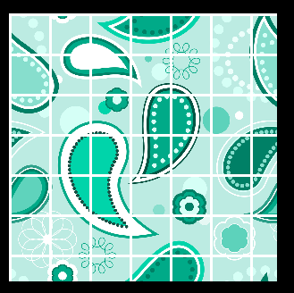
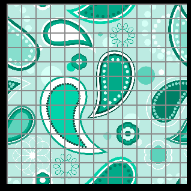

# 网格分割效果

## 原理
通过设定一个固定的距离值(L)，然后检测片元的uv坐标距离这个固定值的距离(D)，通过取余(Q)即可获得网格线的位置范围(R)。
用公式表示即为：
    Dx = u - Lx, Dy = v - Ly;
    Rx = Dx % Qx, Ry = Dy % Qy;
然后可以通过对R的上下加上一定的范围来控制网格线的宽度：
    Rmax = Rx + c, Rmin = R - c;


## 源码
核心代码
```GLSL
  float Dx = v_uv0.x - defaultDistance;
  float Dy = v_uv0.y - defaultDistance;
  float RangeX = mod(Dx * 100.0, meshDistance) / 100.0;
  float RangeY = mod(Dy * 100.0, meshDistance) / 100.0;
  if(RangeX < meshIntensity){
    //如果需要叠加效果 改成 o*=meshColor即可
    o = meshColor;
    o.a = meshAlpha;
  }
  if(RangeY < meshIntensity){
    o = meshColor;
    o.a = meshAlpha;
  }
```

## 效果


