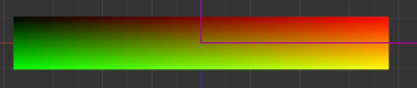

# shader踩坑合集

## 常见问题

### 1. 属性顺序问题
报错：<font color="red">error EFX2205: UBO 'Props' introduces implicit padding: 4 bytes before 'u_custom_radius', consider re-ordering the members</font>

在设置属性时，在块内设置的属性需要保持字节对齐

- **原因：**<mark>uniform block 中的成员在内存布局上引入了隐式填充（implicit padding）。在 GLSL 中，uniform block 的成员按照特定的内存对齐规则存储。</mark>
如果成员的顺序不符合这些规则，可能会导致额外的填充，从而影响性能或引擎的正确解析。

- **深入原因：**
在 GLSL 中，uniform block 默认使用 std140 内存布局（除非另有指定）。以下是 std140 布局的规则：

标量类型（如 float 和 int）：
占用 4 字节。必须对齐到 4 字节边界。

矢量类型（如 vec2、vec3 和 vec4）：
vec2 必须对齐到 8 字节边界。
vec3 和 vec4 必须对齐到 16 字节边界。

数组和结构：
每个元素必须对齐到其自身大小的边界。
如果是 vec3，会自动填充到 16 字节。

**错误示例：**
`uniform Props {
  float u_radius;        // 4 字节
  vec2 u_custom_radius;  // 需要对齐到 8 字节边界
  int is_custom_radius;  // 4 字节，但可能被填充到 8 字节边界
};`

**正确示例：**
`uniform Props {
  vec2 u_custom_radius;  // 需要对齐到 8 字节边界，放在最前面
  float u_radius;        // 4 字节，放在后面
  int is_custom_radius;  // 4 字节，放在最后
};`

### 2. 坐标原点问题

**注意：cocos creator纹理的坐标原点在左上角**
我之前一直以为纹理的坐标原点在左下角，所以导致很多问题，比如圆角矩形绘制不正确。

验证方式：

```glsl
precision mediump float;

uniform sampler2D u_texture;
varying vec2 v_uv; // 传入的纹理坐标

void main() {
    vec4 color = texture2D(u_texture, v_uv);

    // 可视化纹理坐标
    gl_FragColor = vec4(v_uv, 0.0, 1.0);
}
```
测试结果为：


可以看到，左下角为绿色(0,1),左上角为黑色(0,0),右上角为红色(1,0)，右下角为黄色(1,1)


